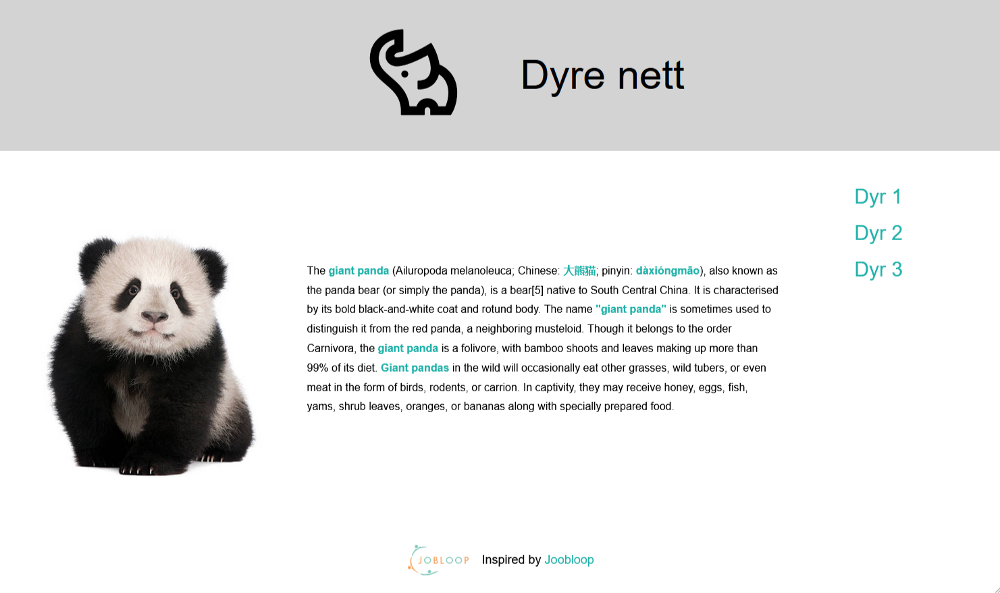

# 2-KH_dyrenett

https://github.com/chriskodehub/2-KH_dyrenett.git

## Oppgave

Vi skal nå lage et nettsted som består av tre nettsider. Nettstedet vårt skal ha tre ulike nettsider som handler om dyr - et pinnsvin, et ekorn og en kanin. De tre nettsidene skal være lenket sammen slik at vi kan navigere mellom dem med interne lenker.

1. Opprett ny mappe på datamaskinen din, og kall den dyrenett.
2. Opprett tre HTML - filer, og lagre dem i mappen dyrenett.
3. I den samme mappen lagrer du tre bilder av dyrene. Vil du har utfordringer, lagrer du bildene i egen mappe.
4. I hvert av HTML-dokumentene skriver du en kort tekst og legger inn bilde.
5. Fra de enkelte nettsidene skal det være mulig å navigere til de andre nettsidene. Vi må derfor legge inn tre lenker på hver av nettsidene.
    
Legg oppgaven på GitHub og lever inn linken på DOKKER.

Lykke til!

## Answer
